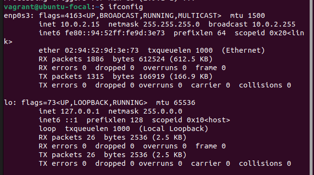

Task: Setup Ubuntu 20.04 LTS on your local machine using Vagrant

Instruction:

1. Customize your Vagrantfile as necessary with private_network set to dhcp.

2. Once the machine is up, run ifconfig and share the output in your submission along with your Vagrantfile in a folder for this exercise.

