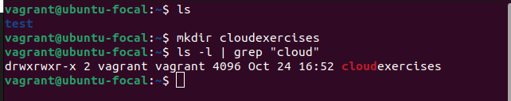
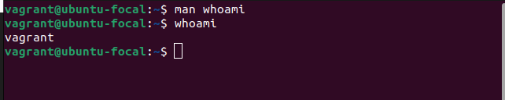
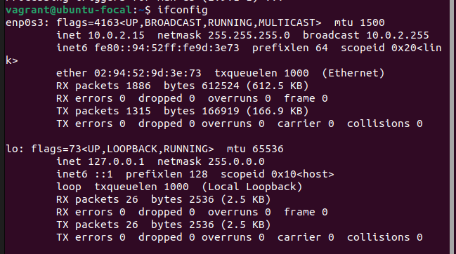
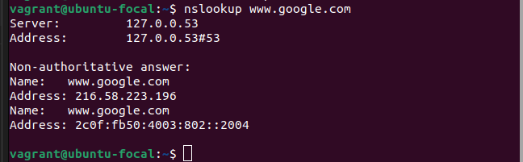
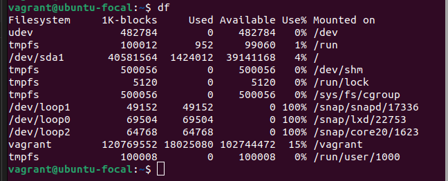
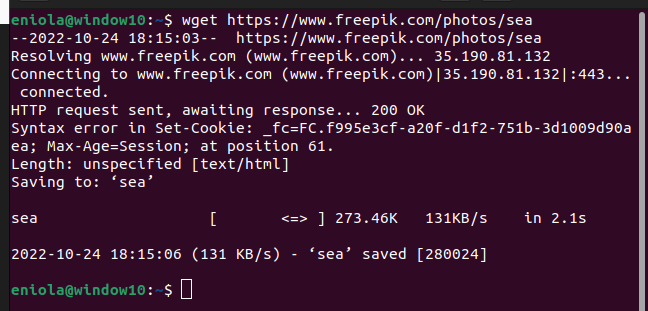
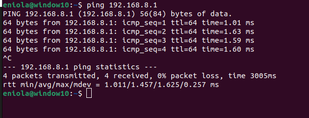
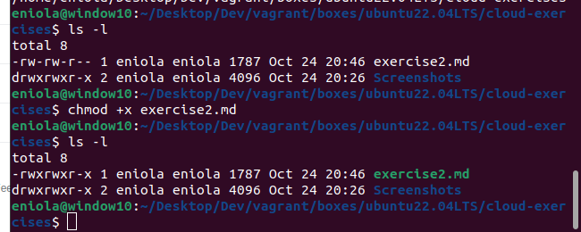
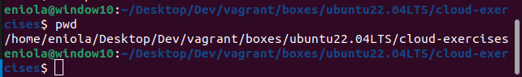
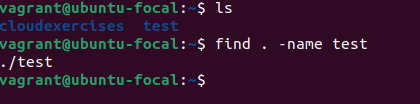

1. ### grep

Description: grep searches for PATTERNS in each FILE

`ls -al |grep `

2. ### whoami 
  
Description : Print  the  user  name associated with the current effective user ID. 

`whoami`

3. ### ifconfig
 
Description : configure a network interface

`ifconfig`

4. ### nslookup

Description : Nslookup is a program to query Internet domain name servers.

`nslookup www.google.com`

5. ### df 

Description : df displays the amount of disk space available on the file  system containing  each  file name argument.

`df`

6. ### wget

Description : GNU Wget is a free utility for non-interactive download of files from the Web.

`wget URL`

7. ### ping

Description : ping uses the ICMP protocol's mandatory ECHO_REQUEST datagram to elicit an ICMP ECHO_RESPONSE from a host or gateway.

`ping IP ADDRESS`

8. ### chmod 
Description : Chmod changes the file mode bits of each given file  according to mode, which can be either a symbolic representation of changes to make, or an octal number representing the bit pattern for the new mode bits.

`chmod +x exercise2.md`

9. ### pwd 

Present Working Directory.

`pwd`

10. ### find 

Description:  find searches the directory tree rooted at each given start‐ing-point by evaluating the given expression  from  left  to right, according to the rules of precedence

`find`

